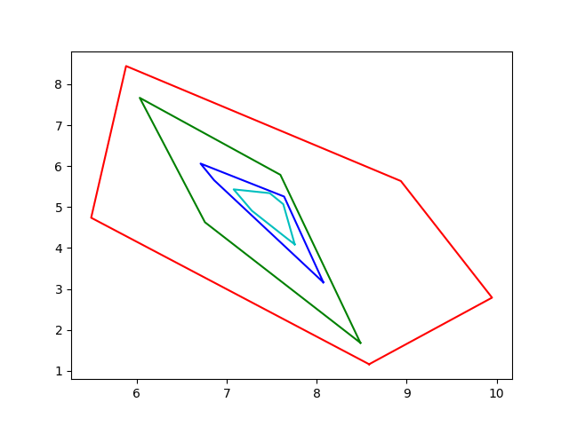

# Polygon Search Examples  

## Blog
https://joeywhelan.blogspot.com/2023/05/redis-polygon-search.html

## Contents
1.  [Summary](#summary)
2.  [Features](#features)
3.  [Prerequisites](#prerequisites)
4.  [Installation](#installation)
5.  [Usage](#usage)

## Summary <a name="summary"></a>
This is a Python demo of early Polygon Search capabilities available with 7.2.0-M01 Redis Stack.  This builds 4 random polygons via the Shapely module.  The 4 polygons are arranged to be layered in containment.  The polygons are stored in Redis as JSON objects.  Redis Search is then leveraged to show the WITHIN and CONTAINS query types.


## Features <a name="features"></a>
- Creates 4 random polygons and plots them on a graphical display
- Stores the Polygons in Redis as JSON objects
- Performs various Redis searches leveraging the WITHIN and CONTAINS queries  

## Prerequisites <a name="prerequisites"></a>
- Docker Compose
- Python

## Installation <a name="installation"></a>
1. Clone this repo.

2.  Install Python requirements
```bash
pip install -r requirements.txt
```

3.  Start Redis Stack
```bash
docker compose up -d
```

## Usage <a name="usage"></a>
### Execution
```bash
python3 poly.py
```

### Plot


### Results
```text
*** Search 1 - Polygons within the Red Polygon ***
Green Polygon
Blue Polygon
Cyan Polygon

*** Search 2 - Polygons within the Green Polygon ***
Blue Polygon
Cyan Polygon

*** Search 3 - Polygons within the Blue Polygon ***
Cyan Polygon

*** Search 4 - Polygons within the Cyan Polygon ***
None

*** Search 5 - Polygons containing the Red Polygon ***
None

*** Search 6 - Polygons containing the Green Polygon ***
Red Polygon

*** Search 7 - Polygons containing the Blue Polygon ***
Red Polygon
Green Polygon

*** Search 8 - Polygons containing the Cyan Polygon ***
Red Polygon
Green Polygon
Blue Polygon
```